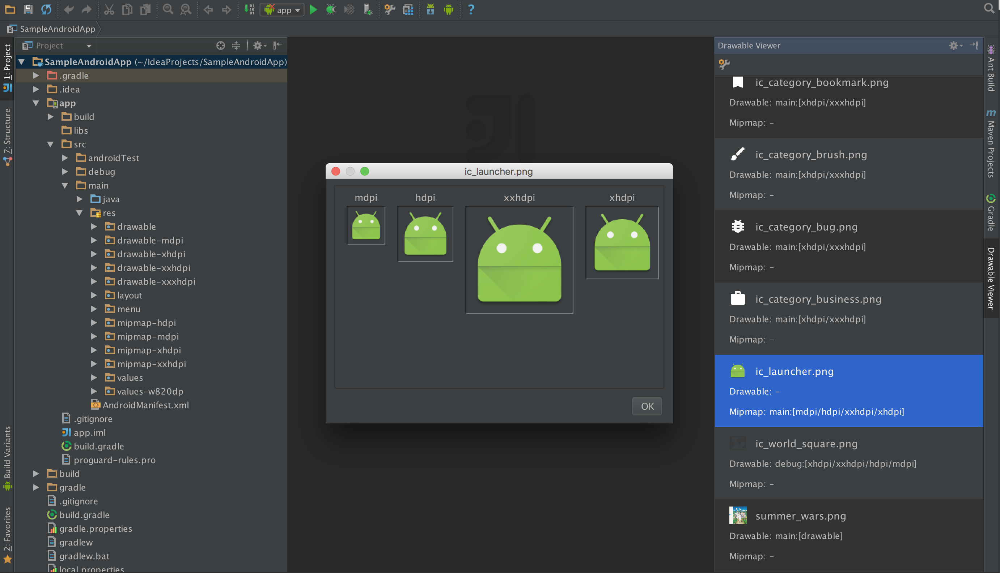

# Android Drawable Viewer

This plugin provide the function that see drawable resources of the android project, support for IntelliJ IDEA and Android Studio.

The page of this plugin is [here](https://plugins.jetbrains.com/plugin/7874?pr=).



# Installation

## 1. From JetBrains Plugin Repository

1. Launch IDE and select "Preferences > Plugins > Browse repositories...".
2. Search "Android Drawable Viewer".
3. Click "Install plugin" button.

## 2. Manually

1. Download the latest release from [here](https://github.com/androhi/AndroidDrawableViewer/blob/master/AndroidDrawableViewer.zip?raw=true).
2. Launch IDE and select "Preferences > Plugins > Install plugin from disk..."
3. Choose `AndroidDrawableViewer.zip` file.

# License

```
Copyright 2015 Takahiro Shimokawa

Licensed under the Apache License, Version 2.0 (the "License");
you may not use this file except in compliance with the License.
You may obtain a copy of the License at

   http://www.apache.org/licenses/LICENSE-2.0

Unless required by applicable law or agreed to in writing, software
distributed under the License is distributed on an "AS IS" BASIS,
WITHOUT WARRANTIES OR CONDITIONS OF ANY KIND, either express or implied.
See the License for the specific language governing permissions and
limitations under the License.
```
